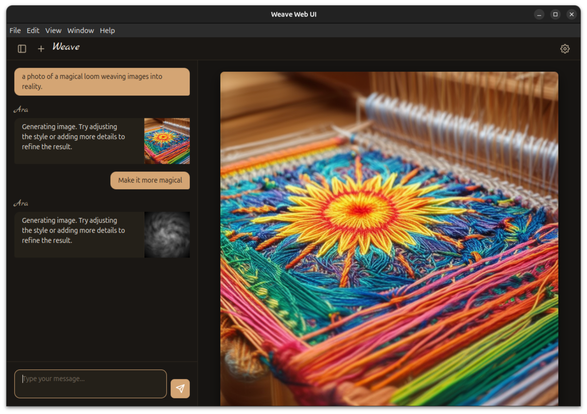

# Weave

> Thread by thread, the image emerges — not from your hand alone, nor the machine's, but from the space between where meaning is made.

Weave is an open-source, local-first desktop application for image generation through natural conversation.

:warning: This project is an early prototype :warning:

There are no guarantees that it works correctly. See the [docs](./docs) for more details about the project.



## Quick start

Prerequisites:
- Go 1.25.5+
- Node.js 18+
- Make
- [ollama](https://ollama.com/) with `mistral:7b` model

Pull the LLM model
Build and run

```bash
ollama pull mistral:7b
make run
```

See [docs/DEVELOPMENT.md](docs/DEVELOPMENT.md) for detailed build instructions and development workflow.

